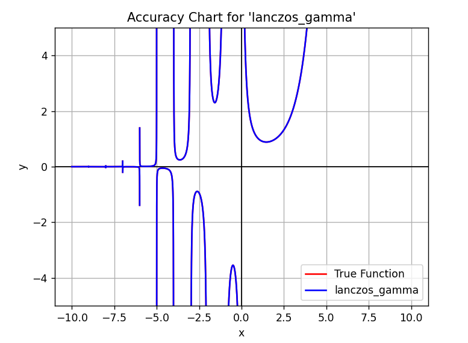
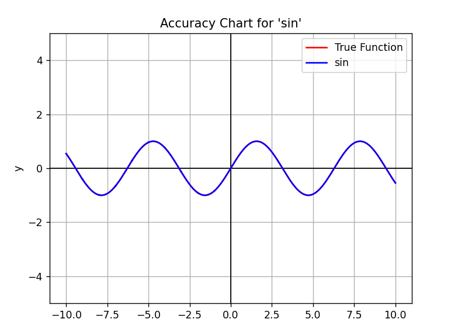
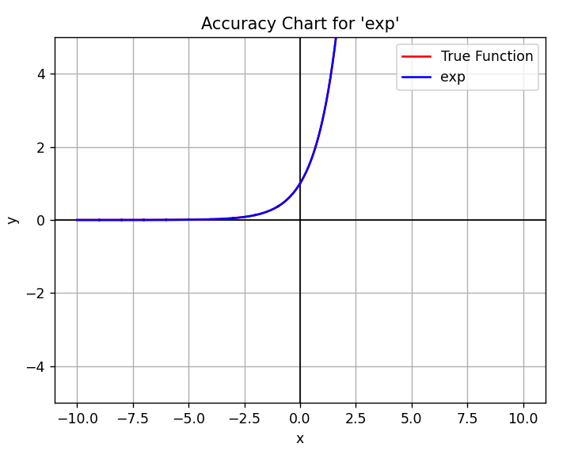

# 🧮 VanillaMath: Constants, Functions, and Complex Numbers with Zero Dependencies

A library of mathematical constants and functions, grouped by purpose and implemented using a variety of numerical techniques. This repository is designed for experimentation, educational use, and precision testing in mathematical computation.

---

## 📦 Overview

There are **five main categories**:

1. 🔁 **Factorial & Gamma Computation**
2. 🔺 **Trigonometry & Circle Constants**
3. 📈 **Exponentials, Logarithms & Euler's Numbers**
4. 🌀 **Golden Ratio & Fibonacci Numbers**
5. 🧩 **Complex Numbers**

---

## 1. 🔁 Factorial & Gamma Functions

Functions related to factorials and extensions like the Gamma function.

| Name        | Method      | Description                                                          |
|-------------|-------------|----------------------------------------------------------------------|
| `factorial` | `default`   | Computes `1⋅2⋅...⋅(x-1)⋅x`.                                            |
| `gamma`     | `recursive` | Approximates `Γ(x)` via recursive extension of factorial.            |
| `gamma`     | `lanczos`   | Efficiently approximates `Γ(x)` using Lanczos approximation.         |
| `mascheroni`| `default`   | Computes Euler's constant `γ` by integrating `exp(-x) * log(x) dx`.  |


📷 _Graph_:  
- 

---

## 2. 🔺 Trigonometry & Circle Constants

Trigonometric functions and core constants related to π.

| Name  | Method      | Description                                                                |
|-------|-------------|----------------------------------------------------------------------------|
| `pi`  | `chudnovsky`| Approximates `π` using the Chudnovsky algorithm.                           |
| `pi`  | `leibniz`   | Approximates `π` using the Madhava-Leibniz series.                         |
| `tau` | `default`   | Returns `τ (2π)`                                                           |
| `sin` | `default`   | Approximates `sin(x)` using Taylor series expansion.                       |
| `cos` | `default`   | Approximates `cos(x)` using Taylor series expansion.                       |
| `tan` | `default`   | Approximates `tan(x)` using trigonometric ratios.                          |


📷 _Graph_:  
- 

---

## 3. 📈 Exponentials, Logarithms & Euler's Numbers

Functions related to the exponential base `e`, its approximations, and logarithmic functions.

| Name  | Method      | Description                                                                |
|-------|-------------|----------------------------------------------------------------------------|
| `e`   | `exp`       | Approximates `e` using the Taylor series for `exp(x)` at `x = 1`.          |
| `e`   | `montecarlo`| Approximates `e` using a Monte Carlo simulation of a Poisson-like process. |
| `exp` | `default`   | Approximates `exp(x)` using Taylor series.                                 |  
| `ln`  | `default`   | Approximates the natural logarithm `ln(x)` using Newton's method.          |


📷 _Graph_:  
- 

---

## 4. 🌀 Golden Ratio & Fibonacci

Functions derived from or related to the golden ratio.

| Name       | Method    | Description                                                             |
|------------|-----------|-------------------------------------------------------------------------|
| `phi`      | `default` | Returns the golden ratio (1 + √5) / 2.                                  |
| `fibonacci`| `default` | Computes the nth Fibonacci number using Binet's formula.                |

---

## 5. 🧩 Complex Numbers

Custom complex number class with additional features. All pythonic operators have been implemented (*with the exception of mod*)
Complex numbers support certain functions already predefined in `functions.py`.
Additionally, complex numbers can be vectorized, allowing for vector manipulation.
Additionally, complex numbers are now iterable. Let z a complex number, z[0] is Re(z) and z[1] is Im(z).

The following list is inexhaustive. Check the source code for the full documentation.

| Name                  | Method     | Description                                                 |
|-----------------------|------------|-------------------------------------------------------------|
| `display_cartesian`   | `default`  | Returns the complex number in Cartesian form *(a + bi)*.    |
| `display_exponential` | `default`  | Returns the complex number in exponential form *(r·e^(iθ))*.|
| `display_polar`       | `default`  | Returns the complex number in polar form *(r·cis(θ))*.      |
| `Re`                  | `default`  | Returns the real part *(Re)* of the complex number.         |
| `Im`                  | `default`  | Returns the imaginary part *(Im)* of the complex number.    |
| `conj`                | `default`  | Returns the complex conjugate *(a − bi)*.                   |
| `__abs__`             | `dunder`   | Returns the modulus r (length) of the complex number.       |
| `arg`                 | `default`  | Returns the argument θ (angle) of the complex number.       |
| `is_gaussian`         | `default`  | Returns `True` if the complex is a Gaussian integer.        |
| `is_eisenstein`       | `default`  | Returns `True` if the complex is an Eisenstein integer.     |

| `dot`                 | `default`  | Returns the dot product of two vectorized complex numbers.  |
| `cross`               | `default`  | Returns the cross product of two vectorized complex numbers.|
| `is_orthogonal`       | `default`  | Checks if two vectorized complex numbers are orthogonal.    |
| `is_collinear`        | `default`  | Checks if two vectorized complex numbers are collinear      |
| `normalize`           | `default`  | Returns the unit vector form of the complex number.         |

---

## 🧠 Architecture

All fundamental functions and constants are stored in two registries, each with multiple generation methods:

- `constants`
- `functions`

You can view all available entries using:
```
print(constants.available())
print(functions.available())
```

You can call a function using:
```
functions.get(name="NAME", method_name="METHOD NAME")("ARGUMENTS")
```

The complex number class is situated in:

- `complex`

You can view all available non-dunder entries using:
```
print([func for func in dir(complex) if callable(getattr(complex, func)) and not func.startswith("__")])
```

Declare a new complex number using either the cartesian form or polar form:
```
a = complex(real = -8.55, imaginary = 6.3)
b = complex(modulus = 0.5, argument = 24)
```

## ⚖️ License

- [MIT](license)
